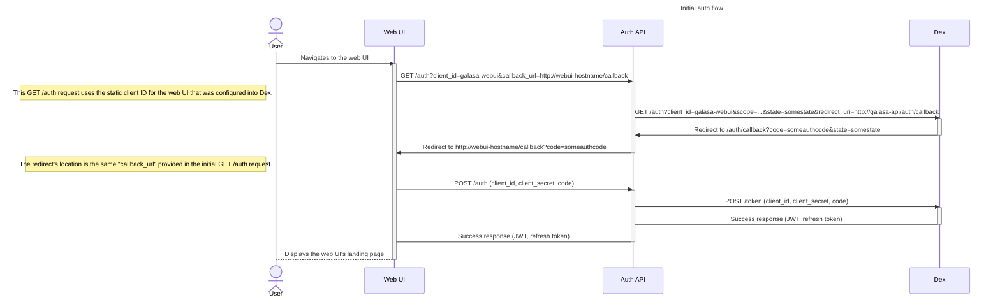
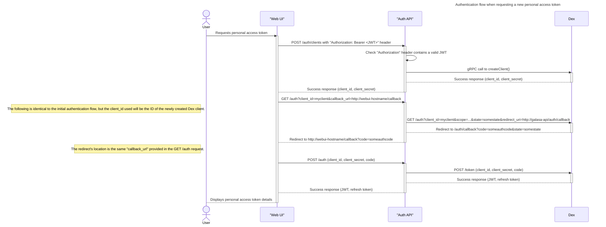
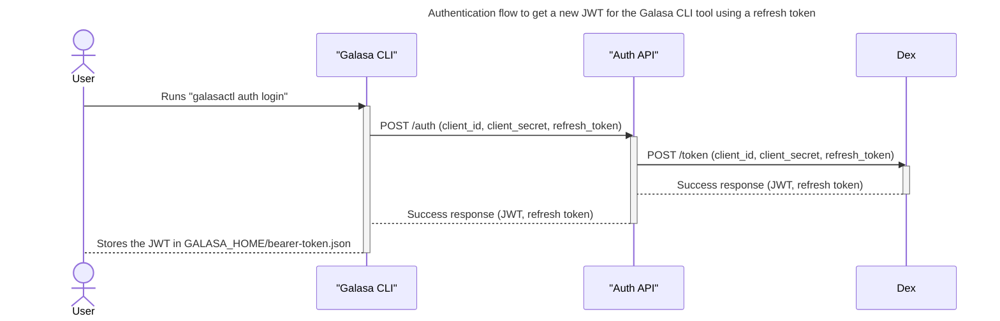
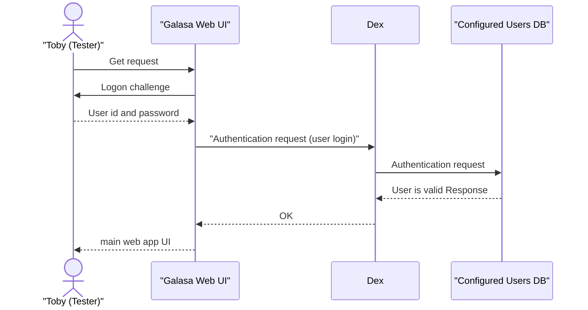
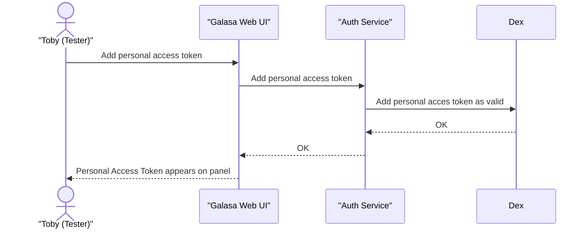
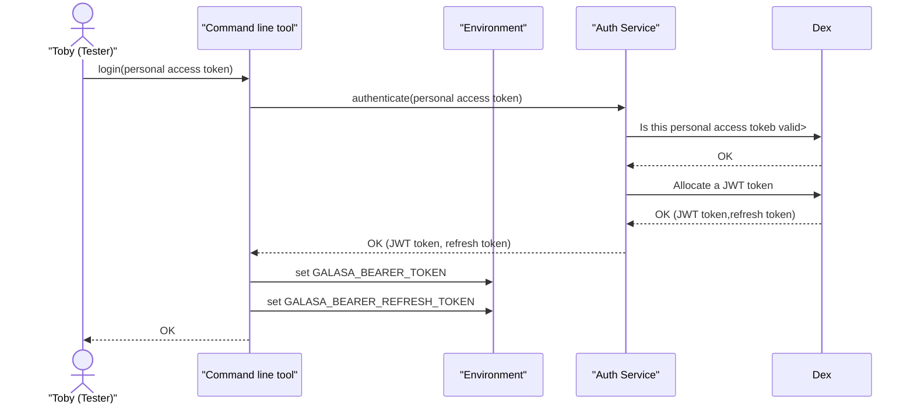
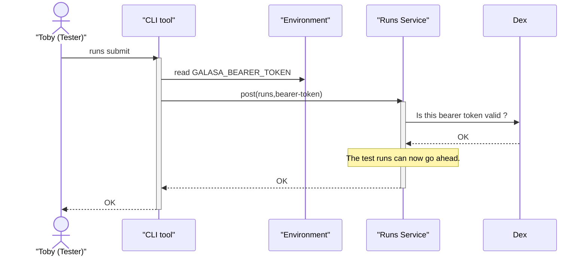

# Authentication Design Notes

## Initial auth flow when user logs into the web UI

## When the Web UI requests a new personal access token

## When the CLI logs-in using a personal access token

## When the user logs in to the web UI...

## When the web UI creates a personal access token

## When the command line logs in

## When the CLI submits a test to the server
